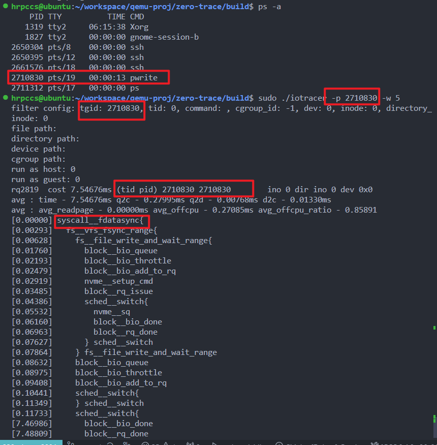
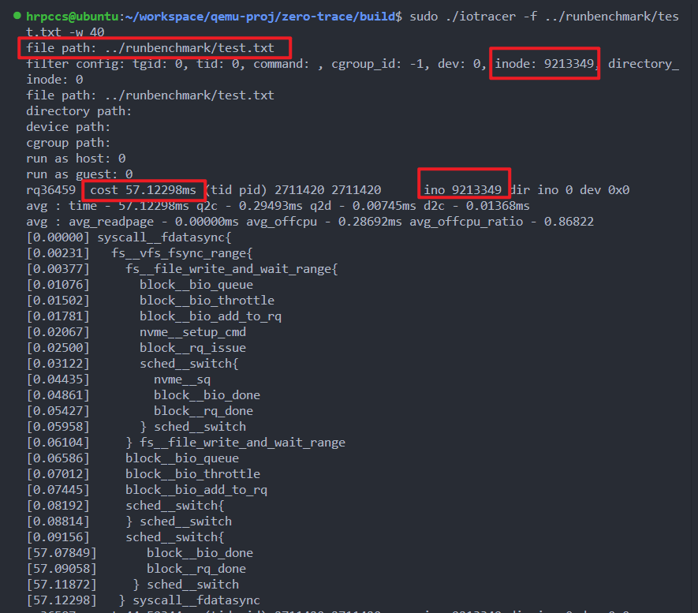
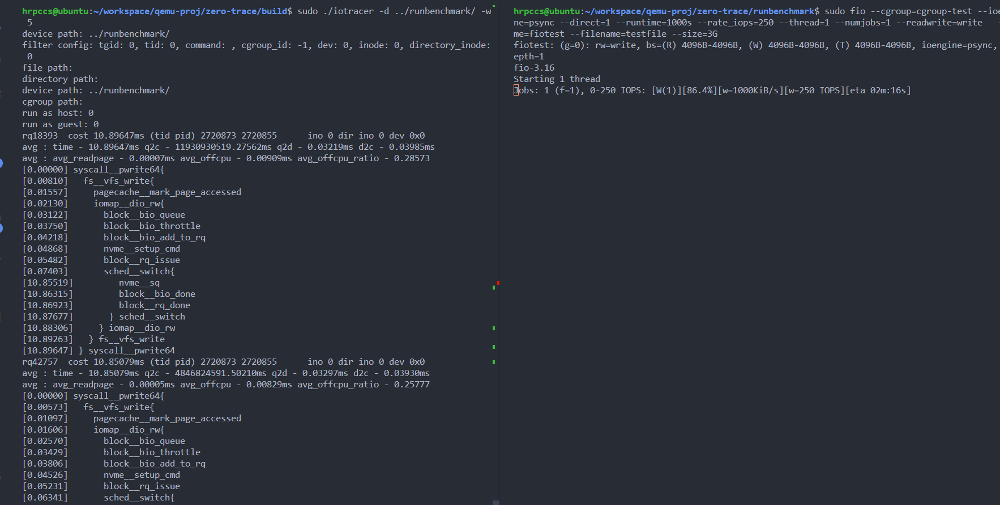
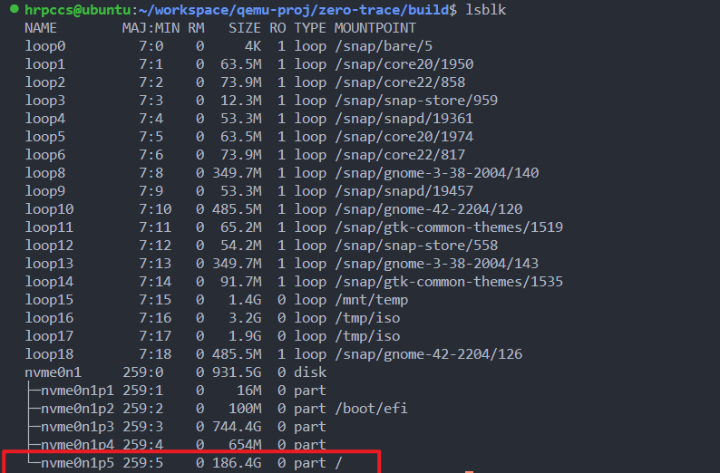
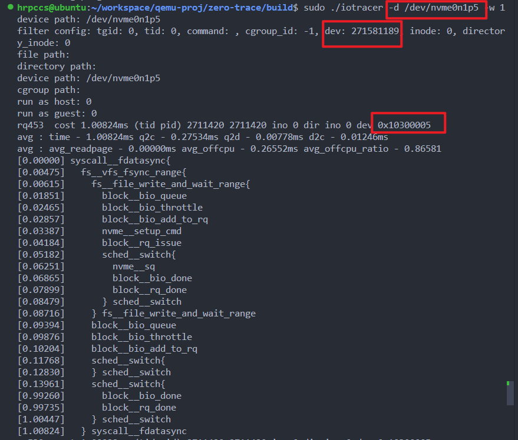

# 功能测试文档

我们已实现的功能如下：

1. 对 bio，request，page 数据结构的追踪，可生成时延报告。

2. 对存储 IO 请求的全链路追踪

   a. 支持 fs 层 + block 层 + driver 层（支持 nvme，scsi，virtio）+磁盘测的全流程处理，包括进程调度核中断干扰到来的 offcpu 时间）

​		b. 统计 IO 请求在各阶段的平均时延

​		c. IO 请求总时延超过某个阈值，输出详细信息

​				A. 支持文件日志输出

​				B. 支持远程接入 Grafana 展示

3. 支持进程，线程，容器（cgroup），磁盘维度，**单一文件，目录级别**的过滤器。

4. 支持 virtio 从 guest 到 host 全链路追踪。

## 功能 1. 对 bio，request，page 数据结构的追踪

本应用可以实现对 bio，request，page 数据结构的追踪，并且我们支持根据 fs 层的请求上下文来过滤 block layer(通用块层)和 driver layer(设备驱动层) 中 bio 和 request 数据结构，减少不必要的追踪，并且可以把 bio，request 的时延路径和 fs 层请求关联起来，从而实现对存储 IO 的全链路追踪。page 数据结构则是在 pagecache 子模块的数据结构，同样我们把 fs 层请求和 page 数据结构关联起来。

所以对这部分的功能验证可以与对存储 IO 请求的全链路追踪一起完成验证。

## 功能 2. 实现对存储 IO 请求的全链路追踪

实现存储 IO 请求在 fs 层+ block 层 + driver 层和磁盘侧的追踪依赖与对 bio，request，page 的追踪。实现追踪的效果就是我们能够把内核中请求涉及到的关键数据结构的执行流事件即 trace 数据抓取了出来，并且在用户态和内核态协同进行 trace 数据的上下文关联，能生成一个存储 IO 请求在内核中的完整处理流程以及时延分析报告。

可以和过滤器机制一起验证。

## 功能 3. 支持过滤器机制

项目基础要求支持进程，线程，容器，磁盘维度的过滤器。

但是发现对单一文件和对某目录内部所有文件的追踪的过滤器也是非常有用的。

这部分功能主要描述为我们的 zero-tracer 程序会尽量过滤来自内核的无关事件，从而在达到用户的追踪功能前提下，尽可能减少开销。

## 功能 4. 支持 virtio 从 guest 到 host 全链路追踪

virtio 的全链路追踪是基于 1，2，3 功能的基础上拓展而来的，所以独立于 1，2，3 功能进行测试。主要需要验证的是，是否可以把 guest OS 对 virtIO 设备发起的 IO 请求的全流程抓出来，包括 guest OS 内核部分流程、qemu 用户态 virtIO 设备模拟流程、host OS 内核部分流程。

## 测试程序

一个对 ../test.txt 的读写程序：pwrite 程序

```cpp
#include <stdio.h>
#include <unistd.h>

// write a file with pwrite system call
// write a file in a unchanged position
int main() {
  FILE *fp;
  char *str[5] = {"hello", "world", "hello", "world", "hello"};
  fp = fopen("test.txt", "w");
  int fd = fileno(fp);
    pwrite(fd, str[0], 5, 0);
    pwrite(fd, str[1], 5, 0);
    pwrite(fd, str[2], 5, 0);
    pwrite(fd, str[3], 5, 0);
    pwrite(fd, str[4], 5, 0);
    fsync(fd);
  while (1) {
    pwrite(fd, str[0], 5, 0);
    fdatasync(fd);
    pwrite(fd, str[1], 5, 0);
    fdatasync(fd);
    pwrite(fd, str[2], 5, 0);
    fdatasync(fd);
    pwrite(fd, str[3], 5, 0);
    fdatasync(fd);
    pwrite(fd, str[4], 5, 0);
    fdatasync(fd);
  }
  fclose(fp);
  return 0;
}
```


## 功能 1，2，3 的测试

要验证 1，2，3 功能，只需要验证 zero-tracer 能够正确根据过滤器的设置，抓取到用户关心的存储 IO 超时请求的详细日志，并且日志中必须包含与该请求有关的 page，bio，request 数据结构的处理流程，并且可以打印出这段时间内的各阶段平均时延。

zero-tracer 支持如下的命令行选项


```shell
./iotracer -p <pid> 
./iotracer -t <tgid>
./iotracer -d <path to device in /dev>
./iotracer -c <path to cgroup>
./iotracer -f <path to file>
./iotracer -D <path to directory>
```

下面正式用 pwrite 测试程序来产生 pwrite 和 fdatasync 系统调用，用于验证我们的过滤功能。

### a.根据进程/线程号进行过滤

**功能描述：为 zero-tracer 提供目标进程的进程号或者线程的线程号，就可以完成对该任务的 IO 活动的追踪过滤。**

可以看到如下本程序成功抓取到进程号为 2710830 的 pwrite 程序的超时 IO 请求。

并且能够打印出该请求在各阶段的时延，比如 io 请求的排队时延——q2d，io 调度结束后发送到硬件设备后到完成请求的时延——d2c，以及这段时间以来请求的平均 q2d 和 d2c，还有进程调度和中断干扰到来的 sched__switch ，这部分可以反映请求的 offcpu 时间。**从而可以验证功能 1，2。**

并且验证了对进程的过滤功能，线程同理。



### b. 根据提供文件相对/绝对路径进行过滤

**功能描述：只需要给 zero-tracer 的 -f 选项提供希望追踪的文件的绝对路径，即可实现对该文件的过滤追踪。**

指定 pwrite 程序即将读写的 test.txt 文件的路径，如果 zero-tracer 能够捕捉到超时请求并且能够输出详细信息。

该命令的目的是捕捉对 ../runbenchmark/test.txt 文件的超过 40 ms 的存储 IO 请求。可以得到如下的一个日志。



### c. 根据提供的目录文件路径进行过滤

**功能描述：提供某一个目录的绝对路径，即可过滤掉目标文件不在该目录下的 IO 请求，完成追踪过滤。**

指定要追踪 runbenchmark 目录下的 IO 请求，然后分别运行 fio 对 testfile 文件读写，而 pwrite 程序在 runbenchmark 目录之外读写。

可以看到目录只会抓取 fio 的 IO 请求，不会抓取到 pwrite 的请求。



### d. 根据设备在 /dev 下的目录进行过滤

**功能描述：只需要向 zero-tracer 提供希望追踪的设备在 /dev 目录下的绝对路径，即可完成对设备的过滤。**



nvme0n1p5 的主设备号为 259，十六进制为 0x103，则在内核中的 dev_t 表示即 0x103 左移 20 位，然后逻辑或从设备号 8。所以一下捕获到的日志的设备号是正确的。



### e. 根据给定某个 cgroup 的绝对路径进行过滤

**功能描述：为 zero-tracer 提供某个 cgroup 所在绝对路径，然后 zero-tracer 即可过滤掉不属于该 cgroup 的任务的 IO 请求，即只追踪由该 cgroup 中任务产生的 IO 请求。**

使用一下命令让 fio 运行在 cgroup-test 表示的 cgroup 里

```shell
sudo fio --cgroup=cgroup-test --ioengine=psync --direct=1 --runtime=1000s --rate_iops=250 --thread=1 --numjobs=1 --readwrite=write   --name=fiotest --filename=testfile --size=3G
```

用 -c /sys/fs/cgroup/unified/cgroup-test 参数即可完成对 cgroup 的过滤。


## 功能 4 的测试

本测试需要 qemu/kvm 场景，并且要求 qemu 的可执行文件是带有完整符号表的，且 qemu 内部挂载了 virtio 设备，这里以 virtblk 为例。

此时 qemu guest OS 中我挂载了 /mnt/virtblk/diska ，这是个 ext4 文件系统，对应的块设备是 virtblk 设备。

此时在 host OS 中，qemu 的进程号为 2277088

所以我在 host OS 中以 Host 模式启动 zero-tracer，并且监控 pid = 2277088 的 qemu IO 活动，命令如下

```shell
sudo ./iotracer -H -p 2277088
```

在 guest OS 中，以 Guest 模式启动 zero-tracer，监控对 /mnt/virtblk/diska/test.txt 文件的读写，并且希望打印整体时延大于 1ms 的 IO 请求。

```shell
sudo ./iotracer -G -f /mnt/virtblk/diska/test.txt -w 1
```

然后在 guest OS 中，运行 pwrite 测试程序，持续尝试 pwrite 和 fdatasync 系统调用。

如下，左边是 host 端的 zero-tracer，右边是 guest 端的 zero-tracer


然后执行 pwrite 程序，对 test.txt 文件进行读写，通过如下可以看出程序正常运行，并且正常生成日志。


用其中一个超时请求信息作为展示：


可以看到一个超时的 fatasync 系统调用，可以看到整个 IO 处理流程经过了 guest OS ，qemu 的 virtblk 模块，然后再到 Host OS 处理。

可以验证我们的追踪 virtblk 的存储 IO 从 guest 到 host 全流程功能是正常的。