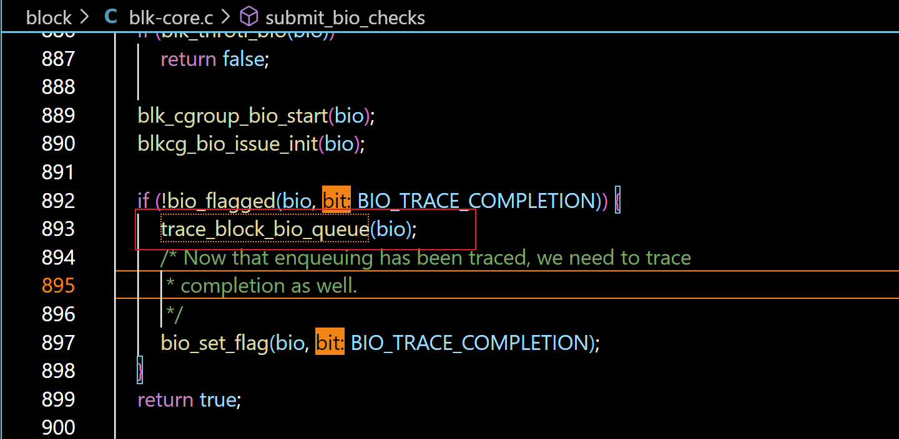
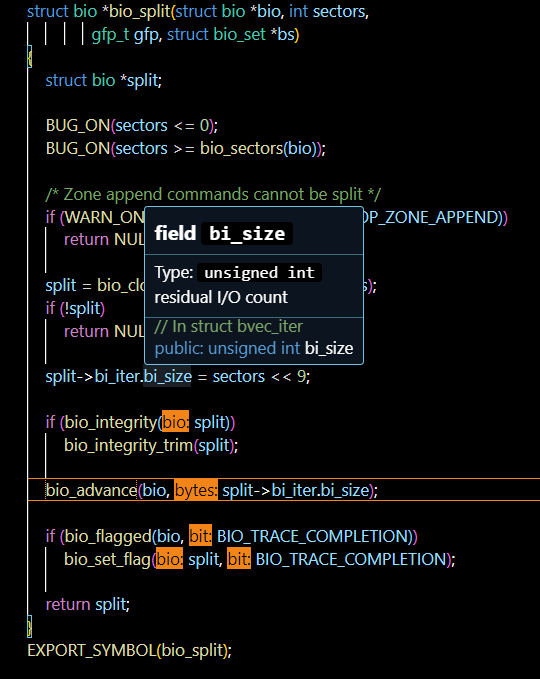

# block layer 关键挂载点语义分析

## block_bio_queue

BIO_TRACE_COMPLETION 的作用是什么？

具体的触发条件描述如下：

无论是上层还是下层驱动发起的 bio 请求，只有经过 trace_block_bio_queue 的 bio 请求，才有可能进入到后续流程被处理。

## block_bio_bounce

一般驱动中不会出现这种情况，主要针对内核中无法容纳的页存储，可以暂时不用考虑。

## block_split

原理简述：首先克隆一个 bio，但会继承 BIO_TRACE_COMPLETION 标志，即 split 出的 bio 也会被追踪。接着修改 bi_iter 的起始扇区和扇区数。bvec 不会被拆分，仍然位于最初的 bio 中。

trace 到的参数是分割后的新 split bio，可以追踪到，但不会进入 submit_bio_noacct，因此只有最初的父 bio 会被 block_bio_queue 捕获。

一个 block 在 split 之后，会将新 split 的 bio 添加到原来 bio 的链表中。

原来 bio 的更改：

- bi_iter 中的扇区数
- 添加一个 BIO_CHAIN 标志
- remaining 增加 1

新 bio ：

- 继承 BIO_TRACE_COMPLETION 标志
- 通过遍历 bi_parent，可以找到最初的父 bio
- bio 的 bio_end_io 回调函数变为 bio_chain_endio

结合 bio_endio，可以总结出：一个 bio 可能被 split 成多个 bio，新 bio 是旧 bio 的低地址部分，但这些 bio 都是链在原始 bio 后面的。新 bio 不会被重新提交，但会继承 BIO_TRACE_COMPLETION，因此可以被追踪到。如果认为一个原始 bio 和其子 bio 都是随机提交 bio_endio 的，那么原始 bio 提交时不一定马上调用 bio_end_io 真正执行结束逻辑。子 bio 完成后会继续处理父 bio。子 bio 的完成会先于父 bio，每次到 bio_endio 开始判断时，原始 bio 的 remainder 会减一，直到所有子 bio 都完成。但每个 bio 只会触发一次 bio_endio，并且会被记录下来。

一个 bio_split 出的新 bio 不会包含 bvec。

那么如何判断这个子 bio 与哪些 IOrequest 相关？如何获得这个子 bio 对应的 bvec？

通过分析 bio_split 函数：

其中 bio_advance 的作用是根据 split->bi_iter.bi_size 修改 bi_iter.idx。

在变动前后的 idx 值就是新 split 出的 bio 对应的 bvec。

新 bio 的 bi_iter.idx 是 split 前的 idx，通过 split->bi_private->bi_iter.idx 可以得到后续 idx。

## block_bio_frontmerge && backmerge / rq_merge

这两个 trace point 捕获的参数只包括参与了 merge 的 bio，但没有参与 merge 的 request 信息。只是将 bio 添加到 rq 的 bio 链表中，然后更新 rq 的起始扇区号和数值。

rq_merge 只捕获了被 merge 的那个 rq 的信息，但无法知道与之合并的 request 信息。

可以使用 rq_qos_merge 来获取 request 和 bio，但这包括了 discard_merge（这包括了）

## block_getrq

这个 tracepoint 的意义在于捕获参数 bio 正式找到一个 request，并将bio 请求与 request 关联起来。然后，bio 请求会进入 request 队列，等待执行。这意味着 bio 请求已经完成了与 request 的匹配，并且即将被处理。

## block_rq_issue

当一个 request 被提交到设备队列并等待执行时，`block_rq_issue` tracepoint 会被触发。这意味着 request 已经从 I/O 调度器队列中移除，并且正在等待设备执行。

## block_rq_complete

`block_rq_complete` tracepoint 表示 request 已经被设备处理完成。通过这个 tracepoint，我们可以知道 request 的执行状态，例如成功或失败，以及 request 的实际处理时间。

总结一下：
每个 bio 请求都会经过 `block_bio_queue`，然后可能会被拆分成多个子 bio。这些子 bio 可能会与其他 bio 合并。最终，bio 请求会被分配给一个 request 并与之关联。request 会在设备队列中等待执行，最后完成处理。通过使用不同的 tracepoints，我们可以追踪 bio 请求的整个生命周期，从创建到完成。