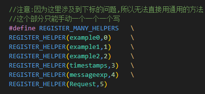

# vsock通信框架使用文档

如果希望在自己的程序中使用这一套vsock传输框架,可以阅读本文档

- [1、对需要传输的类进行序列化](#1对需要传输的类进行序列化)
- [2、为需要传输的类添加辅助函数](#2为需要传输的类添加辅助函数)
- [3、发送/接收数据](#3发送接收数据)
- [4、时钟同步](#4时钟同步)

### 1、对需要传输的类进行序列化

使用例`testcase.h`针对STL,智能指针和继承的情况进行了举例.简单来讲有以下原则

* 基本数据类型都可以序列化
* 能使用该序列化库的数据结构可以查看`cereal/types`,里面有的都可以直接用.主要有大部分的STL,智能指针,chrono,atomic等
* 普通指针是不能用的
* 不包含普通指针的自定义结构体,需要实现serialize函数模板如下,其中archive里面的是该结构体的所有成员.如果没有继承的情况,如下:

```c++
template<class Archive>
void serialize(Archive & archive)
{
   archive(strvec,data); 
}
```

* 如果存在继承,如下,其中example1是基类名.如果继承自多个基类,每个基类都需要这么做

```c++
void serialize( Archive & ar )
{  
    ar( cereal::base_class<example1>( this ), ptr ); 
}
```

* 如果存在多态,比如存在基类Base和派生类Derived1和Derived2,那么需要在头文件末尾这样声明

```c++
//注册派生类(基类不用注册)
CEREAL_REGISTER_TYPE(Derived1);
CEREAL_REGISTER_TYPE(Derived2);

// 声明基类和派生类关系
CEREAL_REGISTER_POLYMORPHIC_RELATION(Base, Derived1);
CEREAL_REGISTER_POLYMORPHIC_RELATION(Base, Derived2);
```

* 几个例子详见`src/include/testcase.h`

### 2、为需要传输的类添加辅助函数

因为受到宏定义的限制,需要修改三处,都在`mesgtype.h`中

* 修改TYPES的值,并将类名添加到TYPE_DEF辅助宏中


* 如果新的类在新的头文件定义,那么在包含对应的头文件


* 在`REGISTER_MANY_HELPERS`宏添加对应类名和标号




### 3、发送/接收数据

我们已经将启动连接,关闭连接,序列化与反序列化等一系列功能进行了封装,成为一个类.只需要一套简单的send/recv操作,就可以实现数据的收发

注意到客户端和服务器可以互相发送数据

我们实现了`ClientEngine`和`ServerEngine`两个类,都继承自`VSockEngine`基类.只需要调用默认构造函数就可以把连接设置好,唯一需要注意的是服务器必须比客户端先启动.

要发送消息,需要调用`sendMsg`方法.其参数为

```c++
int sendMesg(enum Type type,void * obj);
```

* 将该消息的类型和地址传入,可以以阻塞式的方法向对侧发送数据.
* 类型名称为`TYPE_`加上类名,比如`Example`类的类型名称就是`TYPE_example`
* 返回值是系统的send函数返回值

要接收消息,需要调用recvMsg方法,其参数为

```c++
int recvMesg(enum Type & type,void *& obj);
```

* 需要传入一个Type的引用和一个空指针(用来承接对象地址),函数执行后,type就是类型,obj指向一块动态内存区域,存储接收到的对象
* 返回值是系统的recv函数返回值
* 该函数也是阻塞式的,如果没有收到任何信息,会阻塞直到收到信息


该发送/接受框架对于小消息可以直接一次发送,大消息需要分两次发送,第一次发送消息的大小和类型,第二次发送消息内容.这个阈值可以在`mesgtype.h`中的`SMALL_MESG_LIMIT_BYTES`设置,单位是字节,需要是4的倍数


### 4、时钟同步

因为guest和host的时钟未必同步,所以我们需要对guest的时钟进行修正


调用`getDelta`方法,可以获取这个差值

与此同时,在另一端需要设置,当收到`TYPE_timestamps`类型数据时,调用`getDeltaHelper`方法帮助时钟同步

时钟同步功能使用的是单调时钟,防止调时间,闰秒等因素造成对钟失败
