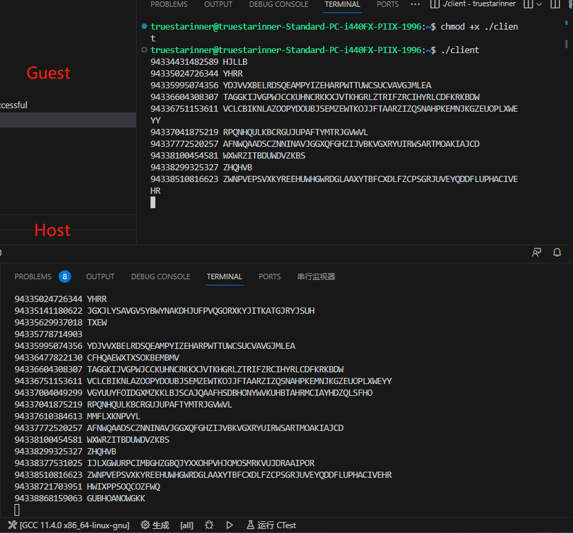

# 试一下你的vsock和cereal安装是否正常吧
* 确保cereal文件夹被放在这个文件夹或者`/usr/include`中
* 编译.如果提示缺少依赖,请自行安装

```shell
sudo bash build.sh
```

* 用`scp`命令或者借助vscode等把可执行文件`client`移动到guest(QEMU)中
    * 如果host是在虚拟机中,用vscode中转时经过了Windows物理机,移动到QEMU之后要用以下命令恢复权限

```shell
chmod +x ./client
```
* 在host(本机)运行server
* 在guest(QEMU)运行client
* 如果运行失败,很可能是QEMU启动的时候忘记添加vsock设备,请[在这里](../doc/environment&vsock.md)检查命令
* 如果运行成功会见到下图所示,左侧是单调时钟的时间戳(单位ns),右侧是随机字符串(长度不大于65)

